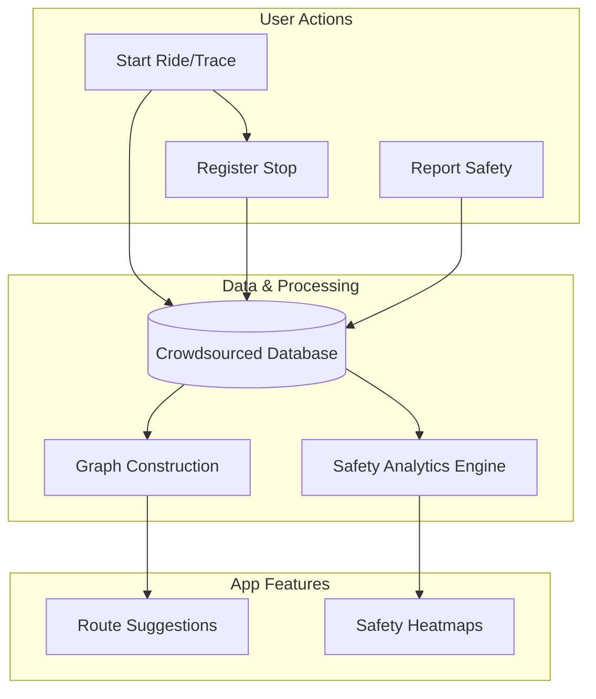

# Commuter
Commuter: Community Powered Guide to Smarter and Safer Public Transit

### App Information
Commuter is a mainly a travel app inspired from ride sharing apps such as Uber. Main difference of Commuter with other mainstream ride sharing applications is that Commuter works with local bus services. It crowdsources information from its own userbase to generate a bus network model. 

### App Features

#### 1. Transit Intelligence
This module leverages crowdsourced data to model and optimize local bus transit.
-   **Crowdsourced Route Mapping**: Automatically records GPS traces while users are in transit to generate accurate bus route data.
-   **Manual Stop Registration**: Enables users to tag and verify specific bus stop locations with a simple, one-touch interaction.
-   **Graph-Based Route Planning**: Utilizes aggregated data to construct a transit graph, allowing for efficient A-to-B route suggestions using graph traversal algorithms.
-   **Fare Reporting & Ride Feedback**: Allows users to input the cost of their journey and provide qualitative feedback on their experience, helping other commuters gauge ride quality and affordability.

#### 2. Safety & Community Metrics
A dedicated module aimed at improving commuter security through collective insights.
-   **Community Safety Reporting**: Provides an intuitive interface for users to report on key safety variables, such as lighting quality and foot traffic, for specific locations or overall areas, independent of active rides.
-   **Dynamic Safety Heatmaps**: Visualizes aggregated community data to help users identify safer travel routes and areas of concern.

#### 3. User Security
Tools designed to provide peace of mind for both commuters and their support network.
-   **Guardian Location Tracking**: A secure, permission-based feature allowing designated guardians to monitor a user’s live location during their journey.

### App Workflow

The Commuter application operates through the synergistic integration of two primary modules, supported by a shared data architecture.

#### 1. Ride Sharing Lifecycle
As users transit, the app continuously logs GPS data. By actively registering stops, users contribute to a growing dataset. This crowdsourced raw data is processed into a transit network graph, which the application then analyzes using graph traversal algorithms to generate reliable A-to-B route suggestions.

#### 2. Safety Metrics Analysis
The Safety Metrics module functions as a parallel analytical engine. It aggregates user-reported safety variables—such as lighting conditions and foot traffic—into a central database. This data is then analyzed to generate dynamic safety heatmaps, providing actionable insights into the safety profile of specific areas and bus routes.

### User Requirements

#### Functional Requirements (FR)
*   **FR-01 (Tracking):** The system shall record and store GPS coordinate streams initiated by the user during a bus ride.
*   **FR-02 (Stop Registration):** The user shall be able to manually register a bus stop location with a simple, one-touch interaction during transit.
*   **FR-03 (Fare/Feedback):** The user shall be able to input the ride fare and provide a qualitative rating/comment upon ride completion.
*   **FR-04 (Route Suggestion):** The system shall calculate and suggest an optimal path from point A to point B using graph traversal algorithms based on aggregated community data.
*   **FR-05 (Safety Reporting):** The user shall be able to submit standalone or location-specific safety surveys containing variables such as lighting condition and foot traffic activity, independent of active ride sessions.
*   **FR-06 (Heatmap Visualization):** The system shall render a dynamic map visualization representing safety metrics for requested areas/routes.
*   **FR-07 (Guardian Access):** The user shall be able to authorize and revoke access for specific guardians to view their real-time location.
*   **FR-08 (Real-time Sharing):** The system shall stream the user's current GPS location to authorized guardians

#### Non-Functional Requirements (NFR)
*   **NFR-01 (Data Anonymization):** The system shall anonymize raw GPS data used for route mapping to ensure individual user movements cannot be uniquely identified in historical public datasets.
*   **NFR-02 (Access Control):** Real-time location streaming shall be encrypted and accessible only to pre-authorized guardian accounts.
*   **NFR-03 (Battery Efficiency):** The GPS logging mechanism shall optimize battery consumption (e.g., adaptive sampling frequency) to allow for continuous tracking during hour-long commutes.
*   **NFR-04 (Latency):** Route suggestions shall be generated and returned to the user within 3 seconds of a request.
*   **NFR-05 (Offline Resilience):** The application shall store data locally when network connectivity is lost and synchronize with the server upon reconnection.
*   **NFR-06 (Intuitive Interface):** The user interface shall enable stop registration and safety reporting in a maximum of 3 taps to minimize distraction during transit.

### Technical Approach
The application will be developed using the **Flutter framework**, enabling cross-platform deployment. To ensure high-quality mapping and navigation capabilities, the application will integrate the **Google Maps Platform**.

-   **Mapping Interface**: Use the `google_maps_flutter` package to provide the primary interactive map interface.
-   **Route Visualization**: Utilize Google Maps Polyline tools to render crowdsourced routes on top of the base map.
-   **Safety Heatmaps**: Implement the Google Maps Heatmap Layer API (via plugins) to visualize aggregated safety data, providing intuitive insights into area safety.
-   **Location Services**: Use the Google Places API for precise bus stop identification and location-based data retrieval.

